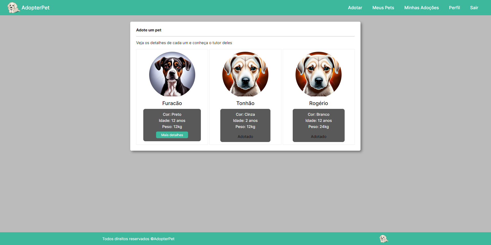
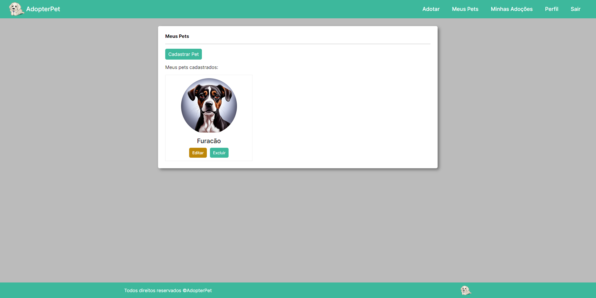
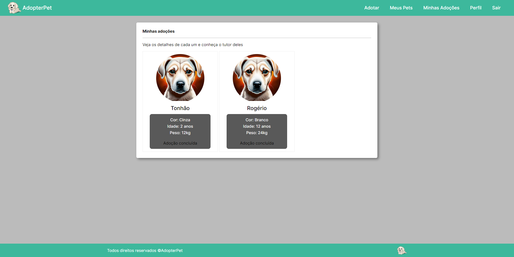
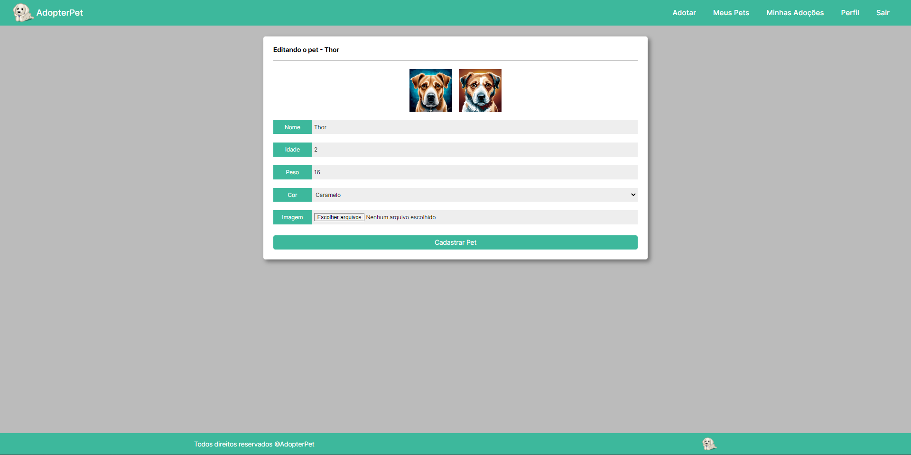
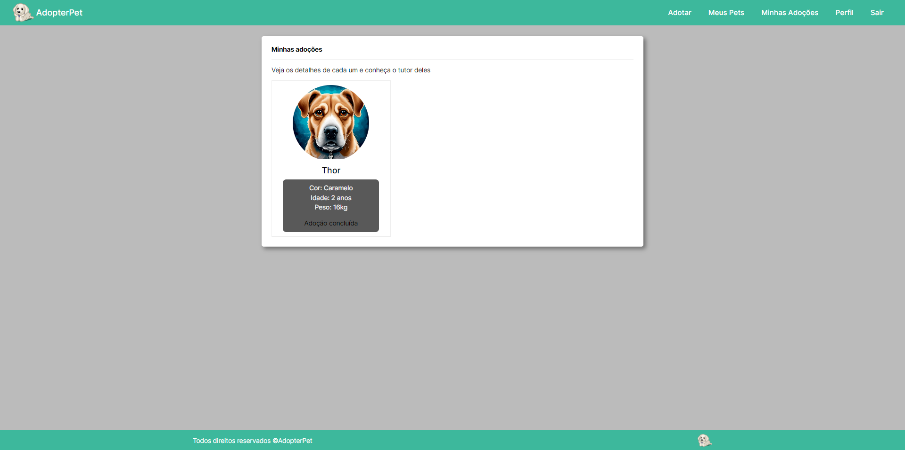
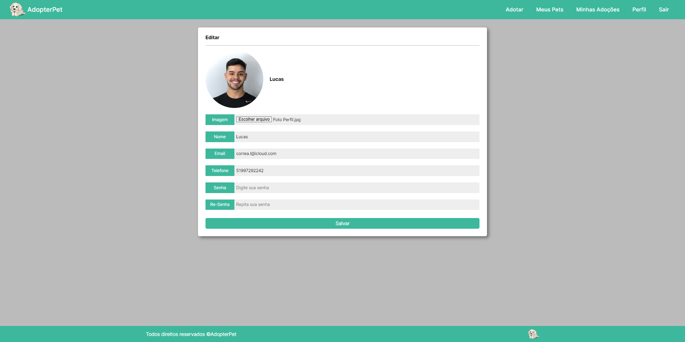

# Amigos Peludos

# ☕ Descrição do Projeto

Projeto em React que fiz para consumir a API de adoção de pet, o projeto consta com diversas libs, como axios, toastify e router dom V6, no entanto para autenticação e permancencia do local storage utilizei o react puro...
Neste sistema é possivel: Criar uma conta, logar, verificar pets adotados e disponiveis para adoção, cadastrar pet para adoção, editar, remover, adotr um pet de outro usuário com opção de aceitar adoção.

## 🤝 Autor

Me chamo Lucas Corrêa, tenho 22 anos, e moro no Rio Grande do Sul.

<table>
  <tr>
    <td align="center">
      <a href="https://www.linkedin.com/in/correalucas0105/">
         
        
            <b>Lucas Corrêa</b>
        
      </a>
    </td>
</table>

OBRIGADO!
